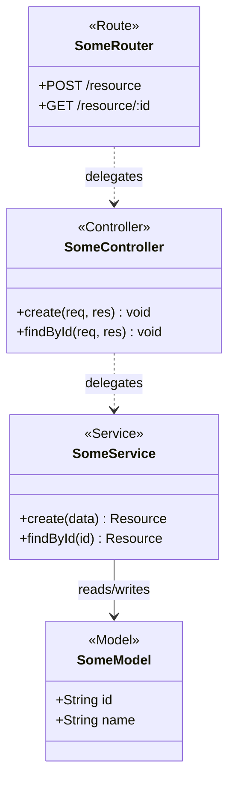

# Class Diagram Rules

---

## Core Principle

**Class Diagram = Full-Stack Blueprint, not just a Database Schema.**

Always read the real project structure first — identify the actual layers present, then apply stereotypes that match.

---

## Layer Stereotypes

Assign every class to its real layer in the project:

| Common Layer | Stereotype |
|---|---|
| API route / router | `<<Route>>` |
| Request handler | `<<Controller>>` |
| Business logic | `<<Service>>` |
| ORM / data model | `<<Model>>` |
| Message/event handler | `<<MQTTHandler>>` / `<<EventHandler>>` |
| Real-time layer | `<<SocketLayer>>` |
| Mobile screen | `<<Screen>>` |
| Mobile API client | `<<MobileService>>` |
| Admin / dashboard page | `<<AdminPage>>` |
| Hardware / firmware module | `<<Hardware>>` |

> Stereotypes are not fixed — define new ones to match the real layers of the project.

---

## Relationship Rules

| From → To | Type | Mermaid | Reason |
|---|---|---|---|
| Route → Controller | Dependency | `..>` | Temporary handler call |
| Controller → Service | Dependency | `..>` | Delegates — does not own lifecycle |
| Service → Model | Association | `-->` | Reads/writes — does not own lifecycle |
| EventHandler → Service | Dependency | `..>` | Temporary trigger |
| Service → RealtimeLayer | Dependency | `..>` | Temporary broadcast |
| Screen → APIClient | Dependency | `..>` | Temporary API call |
| Model → Model (FK) | Association + multiplicity | `"1" --> "*"` | FK relationship |

---

## Scope Rules

- Read project structure first — identify which domains exist
- Show 1 domain per diagram when a specific domain is requested
- More than ~15 classes → recommend splitting into separate diagrams
- Depth: **Overview** (names only) / **Standard** (key methods + attributes) / **Full** (everything)
- Never show every domain in full detail in a single diagram

---

## Mermaid Template

---

## Mandatory Tables

1. `Class Name | Stereotype | Layer | Role | Key Attributes/Methods | Notes`
2. `Source | Target | Type | Notation | Meaning | Reason`
3. `Assumption | Source | Impact if Wrong`
