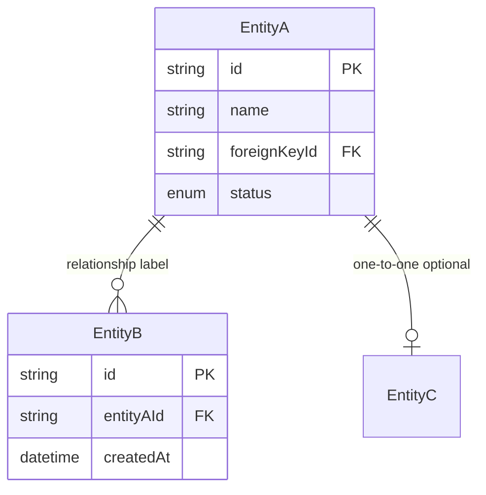

# ER Diagram Rules

---

## Core Principle

**Derive everything from the real schema file only.**

Always read the schema file before drawing:
- Prisma → `schema.prisma`
- SQL → migration files or DDL
- Other ORM → model definitions

Never invent fields, relationships, or constraints not present in the real schema.

---

## Cardinality Rules

| FK | Notation |
|---|---|
| nullable → optional | `o` on that side |
| not nullable → mandatory | `|` on that side |
| unique → at most one | `|` on the many side |
| not unique → many | `{` on the many side |

Examples:
- FK nullable → `o|--o{` (optional-to-many)
- FK not nullable + unique → `||--o|` (one-to-one optional)
- FK not nullable + not unique → `||--o{` (one-to-many optional)

---

## Special Constraints (always document these)

| Case | How to handle |
|---|---|
| Composite PK | Mark attributes with `PK` individually + explain in Design Decisions which attributes form the composite key |
| Logical reference (no physical FK) | Add "logical ref" in the relationship label + explain reason in Design Decisions |
| Soft delete | Document the field used (e.g. `deletedAt`) |
| Polymorphic relation | Document the type discriminator field |

---

## Mermaid Template

---

## Mandatory Tables

1. `Entity | Table | Meaning | PK | FK | Key Attributes | Notes`
2. `Entity A | Entity B | Cardinality | Optionality | Notation | Meaning | Reason`
3. `Entity | Key Type | Attribute | Meaning | Notes`
4. `Issue | Decision | Reason | Impact | Notes`
