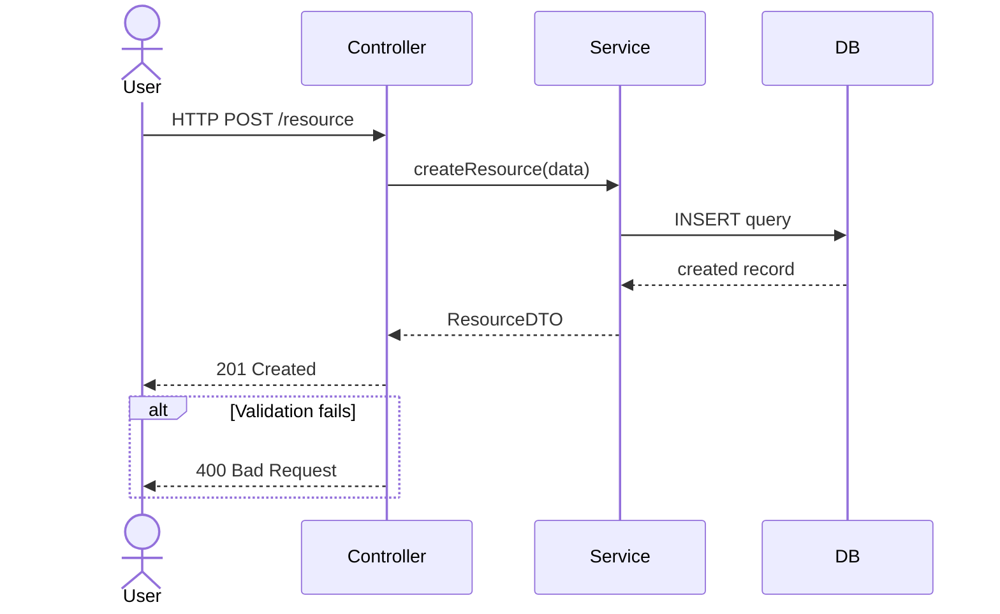

# Sequence Diagram Rules

---

## Core Principle

**Reflect only the real call chain from the code.**

Always read source files first:
- Controller/handler files → understand the real flow
- Service files → understand the business logic chain
- Event/message definitions → understand real topics and async events

---

## Participant Types

| Type | When to use |
|---|---|
| `actor` | Human user or external actor that initiates the flow |
| `participant` | General software component |
| Name from code | Never invent names — use names from actual source files |

---

## Arrow Rules *(OMG §17.4)*

| Arrow | Use when | Never use when |
|---|---|---|
| `->>` | Synchronous call that waits for a response | Async fire-and-forget |
| `-->>` | Response returning | Request |
| `-)` | Async fire-and-forget | Synchronous call that waits for a response |
| `-x` | Fail / reject | — |

**Key rules:**
- Message queue publish / event emit → always `-)`
- HTTP request → `->>`, HTTP response → `-->>`
- Database query → `->>`, result → `-->>`

---

## Fragment Types

| Fragment | When to use |
|---|---|
| `alt` | Conditional if/else |
| `opt` | Optional — may or may not occur |
| `loop` | Repetition |
| `par` | Parallel execution |
| `Note` | Annotation requiring additional explanation |

---

## Mermaid Template

---

## Mandatory Tables

1. `Participant | Type | Role | Reason for inclusion in sequence`
2. `Step | From | To | Message | Arrow | Meaning | Condition`
3. `Fragment | Scope | Meaning | Condition | Reason`
4. `Symbol | Meaning | When to use | Caution`
